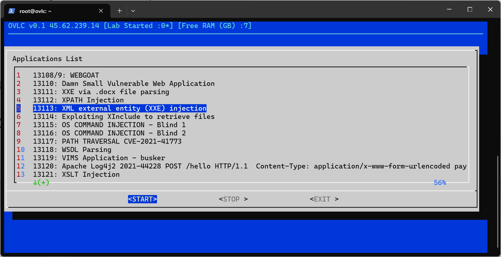
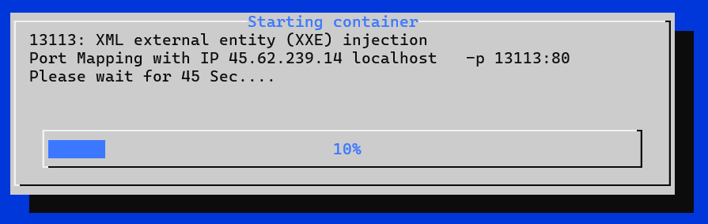

# OVLC (Open Source Vulnerable labs collections) 

OVLC is an open-source penetration testing lab collection that automates the process of downloading and installing dockers in Ubuntu servers.

Screenshots
----

Installation
----

Step 1: Install Ubuntu 22.04.3 LTS 

Step 2 : Switch to root user

Step 3 : curl -s -o /bin/pre_req https://raw.githubusercontent.com/RavikumarRamesh/OVLC/main/pre_req  && chmod +x /bin/pre_req && pre_req

Step 4 : wait and watch ... once it is completed, it will automatically restart.

Usage
----

Login to the machine and execute the command "ovlc"

Start the lab

Links
----
